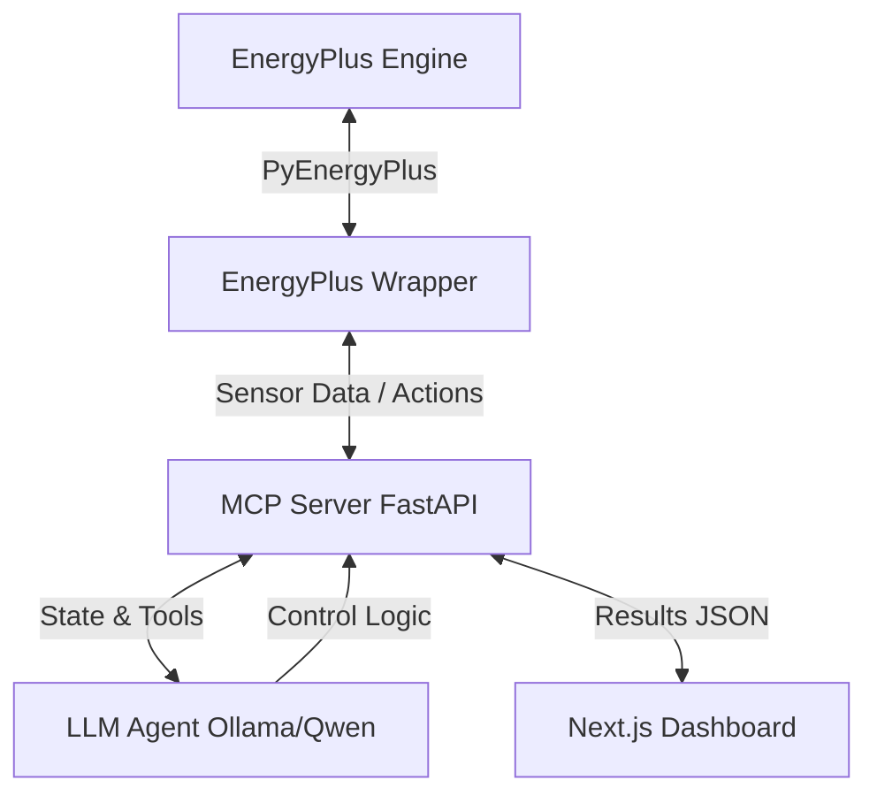

# Eco-Loop Building Agents Architecture

This document describes the system architecture for the Eco-Loop Building Agents platform, built to optimize HVAC energy consumption using real-time generative AI control via the Model Context Protocol (MCP) and True Runtime Injection in EnergyPlus.

## System Overview

The system operates as a closed-loop control system bridging a rigorous building physics engine (EnergyPlus) with an open-source Large Language Model (Qwen 3.5 9B running via Ollama). 

## 1. Runtime Injection (PyEnergyPlus)

Instead of statically modifying `.idf` files, we utilize the `PyEnergyPlus` API for **Runtime Injection**.
- **Callbacks**: We register a callback for the `BeginSystemTimestepBeforePredictor` event.
- **State Reading**: At each timestep, we read `Zone Air Temperature`, `Occupant Count`, `Outdoor Air Drybulb Temperature`, and `Facility Total HVAC Electricity Demand Rate`.
- **Actuation**: We write directly to the `Heating Setpoint` and `Cooling Setpoint` schedule actuators, pushing the LLM's decisions back into the physics engine *while the simulation is paused mid-timestep*.

## 2. LLM Agent Control Loop

The core decision-making is handled by `EcoLoopAgent` located in `src/llm_agent.py`.
- **Model**: Qwen 3.5 9B (via Ollama) is used. The 9B model offers the perfect balance of low-latency real-time inference and sufficient reasoning capabilities for HVAC control.
- **Prompt Engineering**: The LLM is provided a heavily engineered system prompt demanding strict JSON responses. It receives a concise state string (e.g., "Zone temps: avg=22.1°C...").
- **Hallucination Prevention**: 
    1. System prompt strictly enforces structural schema (`{"heating_setpoint": X, "cooling_setpoint": Y}`).
    2. Post-processing validates types and temperature bounds (heating 15-24°C, cooling 21-26°C).
    3. If the LLM hallucinates an invalid response or crashes, a **Rule-Based Fallback Strategy** instantly takes over, ensuring the building remains safe and comfortable.

## 3. MCP Server (Model Context Protocol)

The MCP server (`src/mcp_server.py`) acts as the state-management bus.
- It exposes tools to the LLM (`get_building_state`, `set_zone_setpoints`).
- It buffers the high-frequency EnergyPlus telemetry and exposes it via REST endpoints for the Next.js digital twin.

## 4. Next.js Digital Twin Dashboard

The frontend (`web/`) is built with **Next.js (App Router)** and **TailwindCSS**.
- **Three.js Visualization**: Uses `@react-three/fiber` to render a live digital twin of the 5 zones, highlighting the core concept of a cyber-physical system.
- **Plotly Integration**: Renders real-time telemetry comparisons (Baseline vs. AI-Optimized) for energy consumption and zone temperatures.
