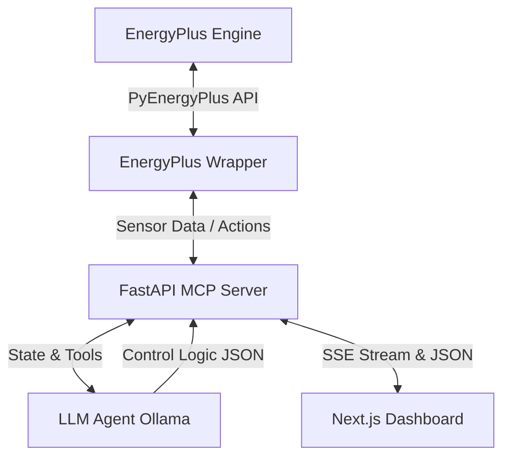

# Eco-Loop Building Agents Architecture

This document describes the system architecture for the Eco-Loop Building Agents platform, a cutting-edge closed-loop control system built to optimize HVAC energy consumption. It bridges rigorous building physics simulation (EnergyPlus) with real-time generative AI control (Local LLMs) via a custom Model Context Protocol (MCP) server.

## System Overview

The system operates continuously, reading high-frequency telemetry from the simulation, streaming it to an LLM for reasoning, and injecting the resulting setpoints back into the simulation without ever stopping the engine.

## 1. True Runtime Injection (PyEnergyPlus)

Traditional EnergyPlus optimization involves statically modifying `.idf` files, running the simulation, parsing the output, and repeating. This system uses the `PyEnergyPlus` Python API for **True Runtime Injection**.

- **Callbacks**: We register a Python callback for the `BeginSystemTimestepBeforePredictor` event. This function is called by the C++ engine on every single simulation timestep.
- **State Reading**: At each timestep, the wrapper reads current values for `Zone Air Temperature`, `Occupant Count`, `Outdoor Air Drybulb Temperature`, and `Facility Total HVAC Electricity Demand Rate` using the EnergyPlus API state handles.
- **Actuation**: Once the LLM makes a decision, the wrapper writes directly to the `Heating Setpoint` and `Cooling Setpoint` schedule actuators using `set_actuator_value()`. This pushes the LLM's decisions back into the physics engine *while the simulation is paused mid-timestep*, dynamically altering the building's trajectory.

## 2. Agentic Tool-Calling Architecture (`src/llm_agent.py`)

The core decision-making is handled by `EcoLoopAgent`, interfacing with local LLMs via Ollama using a rigorous tool-calling approach.

- **Tool-Calling Architecture**: Rather than relying on unstructured text, the LLM is configured to act as a functional agent. We enforce a strict tool-calling schema where the agent must output valid JSON control parameters (`{"heating_setpoint": X, "cooling_setpoint": Y}`). This JSON object acts as the "tool call" which is immediately parsed and passed into the `PyEnergyPlus` injector.
- **Prompt Engineering Strategies**: We use a highly condensed, data-dense system prompt to maximize context efficiency. The agent receives a concise state string summarizing only the critical telemetry for the current timestep (e.g., "Zone temps: avg=22.1°C, Occupants: 12, Power: 5.4kW"). We also enforce bounds constraints within the prompt itself to align the agent's behavior with human comfort requirements.
- **Prompt Latency Management**: Running closed-loop simulations requires millisecond response times. We manage latency through three strategies:
    1. **Model Selection**: Using Llama 3 (`llama3:latest`), which offers the perfect balance of low-latency real-time inference and sufficient reasoning capabilities, while reliably outputting strict JSON formats.
    2. **Streaming Inference**: The agent streams its response (`stream=True`), capturing each token to give immediate UI feedback without waiting for the full response.
    3. **Rule-Based Fallback**: If inference exceeds the maximum allowed timestep latency or the model crashes, a fallback rule-based strategy instantly takes over, ensuring the building remains safe and the loop never blocks.
- **Handling Lengthy Simulation Logs**: Traditional EnergyPlus integrations struggle with parsing massive, gigabyte-sized CSV or SQL output logs after the simulation completes. **Our technical approach bypasses this entirely.** By using PyEnergyPlus for True Runtime Injection, we only read the exact state variables we need directly from memory at the current timestep. We do not parse lengthy simulation logs; we stream the state incrementally, eliminating memory overhead and parsing bottlenecks.
## 3. Self-Correction & Resilience

The system implements a multi-layered self-correction chain to ensure the building is never left uncontrolled, even under LLM failures:

1. **JSON Parsing Validation**: Every LLM response is parsed through `parse_llm_response()`, which strips markdown wrapping, extracts JSON, validates field presence and types, and rejects hallucinated out-of-range values (e.g., heating setpoints below 10°C or above 30°C).
2. **3-Attempt Retry Loop**: If parsing fails, the agent re-prompts the LLM up to 3 times before falling back. Each failure is logged with diagnostic context.
3. **Rule-Based Fallback**: If all 3 LLM attempts fail (or Ollama crashes entirely), a deterministic rule-based strategy takes over. It uses time-of-day and outdoor temperature to set sensible setpoints, ensuring the building remains safe and within comfort bounds.
4. **Safety Clamping**: Even when the LLM succeeds, all setpoints are hardware-clamped in `apply_control_actions()` to the comfort range (19–26°C) with a minimum 1°C deadband. The AI physically cannot produce a dangerous setpoint.
5. **Actuator Persistence**: The last valid AI action is cached and re-applied on every timestep. If the LLM call is skipped (due to the `ai_call_interval`), the cached action persists — EnergyPlus never reverts to default schedules unintentionally.

This chain means the system degrades gracefully: LLM success → retry → fallback → safety clamp, with full observability at each stage via the SSE pipeline stream.

## 4. Synthesized Metrics

In addition to direct EnergyPlus sensor readings (zone temperatures, HVAC energy, occupancy, outdoor weather), the system synthesizes several additional metrics for richer LLM reasoning:

- **Predicted Mean Vote (PMV)**: Approximated as `(zone_temp - 22.5) × 0.33`, providing a simplified Fanger-model comfort index. This is a linear approximation — a full PMV calculation would require radiant temperature, air velocity, and clothing/metabolic rate data not available in this IDF configuration.
- **CO2 Concentration**: Estimated as `400 + (occupant_count × 25)` ppm, modeling baseline atmospheric CO2 plus per-occupant exhalation.  
- **Grid Carbon Intensity**: Modeled with a duck-curve profile: 150 gCO₂/kWh during solar hours (10–15h), 450 during evening peak (17–21h), and 300 baseline otherwise. This enables the LLM to make carbon-aware load-shedding decisions.

These approximations are clearly separated from true EnergyPlus outputs in the codebase (`energyplus_wrapper.py`, lines 287–328) and are sufficient for demonstrating the agent's multi-objective reasoning capabilities.

## 5. MCP Server & Event Bus (`src/mcp_server.py`)

The custom MCP server acts as the central nervous system, managing state and bridging the synchronous EnergyPlus thread with asynchronous Web clients.

- **FastAPI**: Exposes REST endpoints for late-joining clients to fetch current state, optimization history, and comparison data.
- **Thread-Safe SSE Broadcasting**: Uses a standard Python `queue.Queue` to safely pass events from the EnergyPlus execution thread to the FastAPI `asyncio` event loop. This drives a Server-Sent Events (SSE) `/stream` endpoint.
- **Live Metrics**: Calculates pro-rated energy savings and thermal comfort scores on the fly during the simulation, broadcasting them via SSE so the dashboard KPIs update in real-time.
- **Event Flow**: As data flows through the system, the server emits a sequence of events (`pipeline:sensor` → `pipeline:llm_start` → `pipeline:llm_chunk` → `pipeline:llm_done` → `pipeline:injection` → `pipeline:metrics`).

## 6. Next.js Digital Twin Dashboard (`web/`)

The frontend is built with **Next.js (App Router)** and features a premium "liquid glass" aesthetic using CSS custom variables and backdrop blurs.

- **Real-Time Pipeline View**: Connects to the SSE `/stream` endpoint. Visualizes the exact flow of data: EnergyPlus nodes light up when sensors are read, the LLM node displays streaming tokens with a typewriter cursor, and the Injector node lights up when setpoints are pushed back.
- **Three.js Digital Twin**: Uses `@react-three/fiber` and `@react-three/drei` to render an interactive 3D model of the 5-zone building. Hovering over zones reveals live telemetry tooltips.
- **Live Telemetry & KPIs**: Uses Plotly (`react-plotly.js`) for dynamic line charts comparing Baseline vs. AI-Optimized performance. The KPI cards read directly from the SSE metrics stream to show accumulating energy savings as the simulation progresses.
